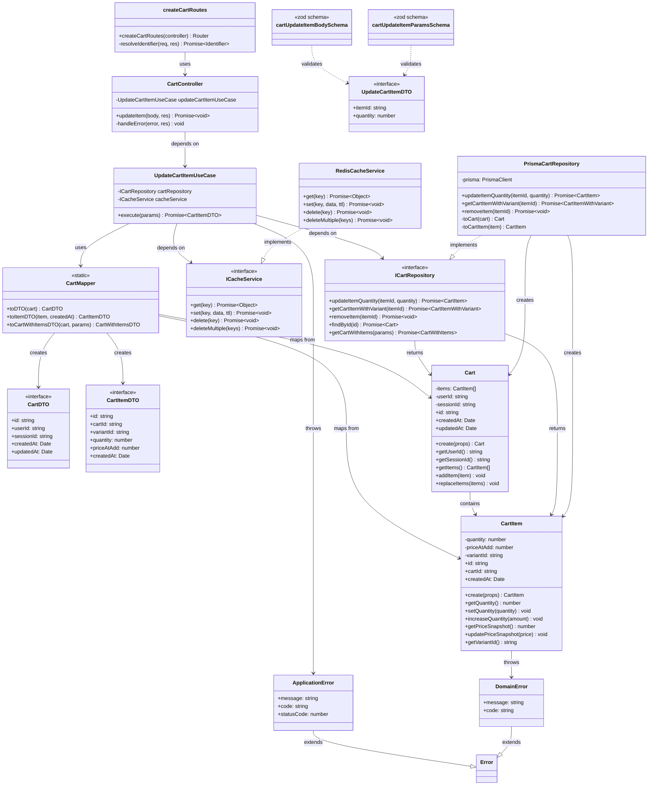

# Update Cart - Entities và Classes (Clean Architecture)

## Bảng Business Rules của các Entities

| Entity | BR (Business Rules) |
|--------|----------------------|
| **Cart** | **### 1.1. Quy tắc tạo giỏ hàng**<br><br>`Mỗi giỏ hàng phải được gắn với một user hoặc một session. Không thể tạo giỏ hàng mà không có userId hoặc sessionId.`<br><br>`Mỗi giỏ hàng phải có một ID duy nhất được tự động tạo khi khởi tạo.`<br><br>`Giỏ hàng mới được tạo luôn bắt đầu với danh sách items rỗng (items = []).`<br><br>`Giỏ hàng phải có createdAt và updatedAt để theo dõi thời gian tạo và cập nhật.`<br><br>**### 1.2. Quy tắc quản lý ownership**<br><br>`Một giỏ hàng có thể thuộc về một user (userId) hoặc một guest session (sessionId), nhưng không thể có cả hai cùng lúc.`<br><br>`Khi assign giỏ hàng cho user, sessionId phải được set về null.`<br><br>`Khi assign giỏ hàng cho session, userId phải được set về null.`<br><br>`Không thể assign userId hoặc sessionId rỗng (empty string).`<br><br>**### 1.3. Quy tắc thêm item vào giỏ hàng**<br><br>`Khi thêm item vào giỏ hàng, nếu item với variantId đã tồn tại, hệ thống sẽ cộng dồn số lượng mới vào số lượng hiện có.`<br><br>`Nếu item với variantId chưa tồn tại, item mới sẽ được thêm vào danh sách.`<br><br>`Khi cộng dồn, giá snapshot (priceAtAdd) của item sẽ được cập nhật theo giá mới nhất.`<br><br>`Giỏ hàng có thể chứa nhiều items khác nhau, mỗi item đại diện cho một product variant.`<br><br>**### 1.4. Quy tắc truy cập dữ liệu**<br><br>`Cart entity sử dụng encapsulation: userId và sessionId là private, chỉ có thể truy cập qua getter methods.`<br><br>`Items trong giỏ hàng được quản lý thông qua methods: getItems(), addItem(), replaceItems().`<br><br>`Cart entity không thể được tạo trực tiếp bằng constructor, phải sử dụng static method create().` |
| **CartItem** | **### 2.1. Quy tắc tạo cart item**<br><br>`Mỗi cart item phải được gắn với một cart cụ thể thông qua cartId.`<br><br>`Mỗi cart item phải được gắn với một product variant cụ thể thông qua variantId.`<br><br>`Mỗi cart item phải có một ID duy nhất được tự động tạo khi khởi tạo.`<br><br>`Cart item phải có createdAt để theo dõi thời gian thêm vào giỏ hàng.`<br><br>**### 2.2. Quy tắc về số lượng (quantity)**<br><br>`Số lượng (quantity) của cart item phải luôn lớn hơn 0. Không thể tạo cart item với quantity <= 0.`<br><br>`Khi set quantity, hệ thống phải validate quantity > 0, nếu không sẽ throw DomainError với code "INVALID_QTY".`<br><br>`Khi increase quantity, tổng số lượng sau khi tăng phải > 0, nếu không sẽ throw DomainError.`<br><br>`Quantity là private field, chỉ có thể thay đổi thông qua methods: setQuantity(), increaseQuantity().`<br><br>**### 2.3. Quy tắc snapshot giá (priceAtAdd)**<br><br>`Khi thêm sản phẩm vào giỏ hàng, hệ thống phải lưu snapshot (bản chụp) của giá sản phẩm tại thời điểm thêm vào (priceAtAdd).`<br><br>`Giá snapshot phải >= 0. Không thể set giá âm, nếu không sẽ throw DomainError với code "INVALID_PRICE".`<br><br>`Giá snapshot được sử dụng để tính toán tổng tiền, không phụ thuộc vào việc giá có thay đổi sau đó.`<br><br>`Khi cộng dồn item (item đã tồn tại), giá snapshot có thể được cập nhật theo giá mới nhất.`<br><br>`PriceAtAdd là private field, chỉ có thể truy cập qua getPriceSnapshot() và thay đổi qua updatePriceSnapshot().`<br><br>**### 2.4. Quy tắc truy cập dữ liệu**<br><br>`CartItem entity sử dụng encapsulation: quantity, priceAtAdd, variantId là private, chỉ có thể truy cập qua getter methods.`<br><br>`CartItem không thể được tạo trực tiếp bằng constructor, phải sử dụng static method create().`<br><br>`VariantId là readonly, không thể thay đổi sau khi tạo.`<br><br>`CartId là readonly, không thể thay đổi sau khi tạo.` |

---

## Bảng Business Rules ở Application Layer (Use Cases)

> **Lưu ý**: Các quy tắc dưới đây được xử lý ở **Application Layer** (Use Cases), không phải Domain Layer. Đây là sự khác biệt quan trọng trong Clean Architecture:
> - **Domain Rules**: Được enforce bởi Entities (ví dụ: quantity > 0)
> - **Application Rules**: Được enforce bởi Use Cases (ví dụ: kiểm tra tồn kho, product status)

| Use Case | BR (Business Rules) |
|----------|---------------------|
| **AddItemToCartUseCase** | **### 3.1. Quy tắc kiểm tra số lượng**<br><br>`Trước khi thêm sản phẩm vào giỏ hàng, quantity phải > 0. Nếu quantity <= 0, throw ApplicationError với code "INVALID_QUANTITY".`<br><br>**### 3.2. Quy tắc kiểm tra variant tồn tại**<br><br>`Trước khi thêm sản phẩm vào giỏ hàng, hệ thống phải kiểm tra variant có tồn tại không. Nếu không tồn tại, throw ApplicationError với code "VARIANT_NOT_FOUND".`<br><br>**### 3.3. Quy tắc kiểm tra trạng thái sản phẩm**<br><br>`Trước khi thêm sản phẩm vào giỏ hàng, hệ thống phải kiểm tra product status = "PUBLISHED". Nếu không, throw ApplicationError với code "VARIANT_UNAVAILABLE".`<br><br>**### 3.4. Quy tắc snapshot giá**<br><br>`Khi thêm sản phẩm vào giỏ hàng, hệ thống phải lưu snapshot của giá. Ưu tiên salePrice, nếu không có thì dùng price.`<br><br>`Giá snapshot được lưu vào priceAtAdd của CartItem entity.`<br><br>**### 3.5. Quy tắc cộng dồn số lượng**<br><br>`Nếu sản phẩm đã có trong giỏ hàng (cùng variantId), repository sẽ tự động cộng dồn số lượng mới vào số lượng hiện có.`<br><br>**### 3.6. Quy tắc cache**<br><br>`Sau khi thêm item vào giỏ hàng, hệ thống phải xóa cache của giỏ hàng (key: "cart:{cartId}") để đảm bảo dữ liệu được refresh.` |
| **UpdateCartItemUseCase** | **### 4.1. Quy tắc kiểm tra số lượng**<br><br>`Quantity phải >= 0. Nếu quantity < 0, throw ApplicationError với code "INVALID_QUANTITY".`<br><br>`Nếu quantity = 0, hệ thống sẽ xóa item khỏi giỏ hàng và trả về null.`<br><br>**### 4.2. Quy tắc kiểm tra cart item tồn tại**<br><br>`Trước khi cập nhật, hệ thống phải kiểm tra cart item có tồn tại không. Nếu không tồn tại, throw ApplicationError với code "CART_ITEM_NOT_FOUND".`<br><br>**### 4.3. Quy tắc kiểm tra trạng thái sản phẩm**<br><br>`Trước khi cập nhật, hệ thống phải kiểm tra product status = "PUBLISHED". Nếu không, throw ApplicationError với code "VARIANT_UNAVAILABLE".`<br><br>**### 4.4. Quy tắc kiểm tra tồn kho**<br><br>`Trước khi cập nhật, hệ thống phải kiểm tra số lượng tồn kho có đủ để đáp ứng yêu cầu hay không.`<br><br>`Nếu quantity > stockQuantity, throw ApplicationError với code "INSUFFICIENT_STOCK" và message "Insufficient stock. Only X items available."`<br><br>`Nếu số lượng tồn kho đủ, hệ thống cho phép cập nhật quantity.`<br><br>**### 4.5. Quy tắc cache**<br><br>`Sau khi cập nhật item, hệ thống phải xóa cache của giỏ hàng (key: "cart:{cartId}") để đảm bảo dữ liệu được refresh.` |

---

## Phân biệt Domain Rules vs Application Rules

### Domain Rules (trong Entities)
- **Mục đích**: Đảm bảo tính toàn vẹn của domain model
- **Vị trí**: Domain Layer (Entities, Value Objects)
- **Ví dụ**: 
  - Cart phải có userId hoặc sessionId
  - CartItem quantity phải > 0
  - CartItem priceAtAdd phải >= 0

### Application Rules (trong Use Cases)
- **Mục đích**: Orchestrate business logic, kiểm tra điều kiện phức tạp
- **Vị trí**: Application Layer (Use Cases)
- **Ví dụ**:
  - Kiểm tra tồn kho (cần query từ database)
  - Kiểm tra product status (cần query từ database)
  - Xử lý cache (infrastructure concern)

### Tại sao tách biệt?

1. **Domain Rules**: Độc lập với infrastructure, có thể test dễ dàng
2. **Application Rules**: Phụ thuộc vào infrastructure (database, cache), cần integration tests
3. **Separation of Concerns**: Domain chỉ quan tâm business logic, Application quan tâm orchestration

---

## Danh sách Entities và Classes liên quan đến Update Cart

### 1. Domain Layer (Lớp Domain)

#### Entities
- **Cart** (`domain/entities/cart.entity.ts`)
  - Entity đại diện cho giỏ hàng
  - Quản lý userId, sessionId, và danh sách items
  - Methods: `getUserId()`, `getSessionId()`, `getItems()`, `addItem()`, `replaceItems()`

- **CartItem** (`domain/entities/cart-item.entity.ts`)
  - Entity đại diện cho một item trong giỏ hàng
  - Quản lý quantity, priceAtAdd, variantId
  - Methods: `getQuantity()`, `setQuantity()`, `increaseQuantity()`, `getPriceSnapshot()`, `updatePriceSnapshot()`, `getVariantId()`

#### Repository Interface
- **ICartRepository** (`domain/repositories/cart.repository.ts`)
  - Interface định nghĩa các phương thức truy cập dữ liệu cart
  - Methods liên quan update: `updateItemQuantity()`, `getCartItemWithVariant()`, `removeItem()`

#### Domain Errors
- **DomainError** (`shared/errors/domain.error.ts`)
  - Base error class cho domain layer violations

---

### 2. Application Layer (Lớp Application)

#### Use Cases
- **UpdateCartItemUseCase** (`application/use-cases/cart/update-cart-item.use-case.ts`)
  - Use case chính xử lý logic cập nhật cart item
  - Dependencies: `ICartRepository`, `ICacheService`
  - Method: `execute(params: { itemId: string; quantity: number })`

#### Mappers
- **CartMapper** (`application/use-cases/cart/cart.mapper.ts`)
  - **Pattern DDD**: Đây là pattern **Mapper/Assembler** trong DDD
  - **Mục đích**: Chuyển đổi giữa Domain Entities (Cart, CartItem) và DTOs
  - **Vị trí**: Application Layer (đúng vị trí trong Clean Architecture)
  - **Lý do**: Tách biệt Domain Model khỏi Presentation Layer, bảo vệ domain entities khỏi việc expose trực tiếp
  - Methods: `toDTO()`, `toItemDTO()`, `toCartWithItemsDTO()`
  - **Lưu ý**: Trong DDD, pattern này còn được gọi là **Assembler** khi phức tạp hơn (aggregate nhiều entities)

#### DTOs (Data Transfer Objects)
- **CartDTO** (`application/dto/cart.dto.ts`)
  - DTO cho Cart entity
- **CartItemDTO** (`application/dto/cart.dto.ts`)
  - DTO cho CartItem entity
- **UpdateCartItemDTO** (`application/dto/cart.dto.ts`)
  - DTO cho input update cart item

#### Interfaces
- **ICacheService** (`application/interfaces/cache.interface.ts`)
  - Interface định nghĩa các phương thức cache
  - Methods: `get()`, `set()`, `delete()`, `deleteMultiple()`

#### Application Errors
- **ApplicationError** (`shared/errors/application.error.ts`)
  - Base error class cho application layer errors

---

### 3. Infrastructure Layer (Lớp Infrastructure)

#### Repository Implementation
- **PrismaCartRepository** (`infrastructure/persistence/prisma/cart.repository.impl.ts`)
  - Implementation của `ICartRepository` sử dụng Prisma
  - Methods liên quan update: `updateItemQuantity()`, `getCartItemWithVariant()`, `removeItem()`
  - Private methods: `toCart()`, `toCartItem()`

#### Cache Service Implementation
- **RedisCacheService** (`infrastructure/cache/redis-cache.service.ts`)
  - Implementation của `ICacheService` sử dụng Redis
  - Methods: `get()`, `set()`, `delete()`, `deleteMultiple()`

---

### 4. Presentation Layer (Lớp Presentation)

#### Controllers
- **CartController** (`presentation/controllers/cart.controller.ts`)
  - Controller xử lý HTTP requests
  - Method: `updateItem(body: { itemId: string; quantity: number }, res: Response)`
  - Dependencies: `UpdateCartItemUseCase`

#### Routes
- **createCartRoutes** (`presentation/routes/v1/cart.routes.ts`)
  - Route handler cho PUT `/items/:itemId`
  - Sử dụng validators và controller

#### Validators
- **cartUpdateItemParamsSchema** (`presentation/validators/cart.validator.ts`)
  - Zod schema validate params (itemId)
- **cartUpdateItemBodySchema** (`presentation/validators/cart.validator.ts`)
  - Zod schema validate body (quantity)

---

## Sơ đồ Class theo Clean Architecture

> **Lưu ý**: Sơ đồ Mermaid đã được đơn giản hóa cú pháp để tương thích. Một số return types có thể là `null` (được ghi chú trong code thực tế). Generic types và union types phức tạp đã được thay thế bằng tên type đơn giản hơn.



---

## Luồng xử lý Update Cart (Flow)

1. **Presentation Layer**: 
   - Route handler nhận request PUT `/items/:itemId`
   - Validator kiểm tra params và body
   - Controller gọi use case

2. **Application Layer**:
   - Use case validate input (quantity >= 0)
   - Use case gọi repository để lấy cart item với variant info
   - Use case kiểm tra business rules:
     - Cart item tồn tại
     - Quantity = 0 → xóa item
     - Product status = PUBLISHED
     - Stock đủ
   - Use case gọi repository update quantity
   - Use case xóa cache
   - Use case map entity → DTO và trả về

3. **Domain Layer**:
   - Entity Cart và CartItem chứa business logic
   - Repository interface định nghĩa contract

4. **Infrastructure Layer**:
   - PrismaCartRepository thực hiện truy vấn database
   - RedisCacheService thực hiện cache operations

---

## Dependency Flow (Luồng phụ thuộc)

```
Presentation → Application → Domain ← Infrastructure
     ↓              ↓           ↑            ↑
  Routes      Use Cases    Entities    Repository Impl
Controller    Mappers      Interfaces  Cache Impl
Validators    DTOs         Errors
```

**Nguyên tắc**: 
- Các layer bên ngoài phụ thuộc vào layer bên trong
- Domain layer không phụ thuộc vào bất kỳ layer nào
- Infrastructure implement các interface từ Domain và Application

---

## Phân tích CartMapper trong DDD

### CartMapper có phải là pattern DDD không?

**Có**, CartMapper là một pattern hợp lệ trong DDD, cụ thể là **Mapper/Assembler Pattern**.

### 1. Pattern Mapper trong DDD

**Định nghĩa**: Mapper là một component chịu trách nhiệm chuyển đổi giữa:
- **Domain Entities** (trong Domain Layer) 
- **DTOs** (trong Application/Presentation Layer)

### 2. Tại sao cần Mapper?

#### ✅ Bảo vệ Domain Model
- Domain entities không bị expose trực tiếp ra ngoài
- Tránh việc serialize domain objects (có thể chứa business logic phức tạp)
- Giữ domain layer độc lập với presentation concerns

#### ✅ Tách biệt Concerns
- Domain entities: Chứa business logic và rules
- DTOs: Chỉ chứa data để transfer, không có logic

#### ✅ Linh hoạt trong Presentation
- Có thể tạo nhiều DTOs khác nhau từ cùng một Entity
- Ví dụ: `CartDTO`, `CartSummaryDTO`, `CartWithItemsDTO` từ cùng `Cart` entity

### 3. Vị trí của Mapper trong Clean Architecture

```
Domain Layer (Entities)
    ↑
Application Layer (Mappers, DTOs) ← CartMapper ở đây
    ↑
Presentation Layer (Controllers, Routes)
```

**Lý do đặt ở Application Layer**:
- Mapper cần hiểu cả Domain Entities và DTOs
- Application Layer là nơi orchestrate giữa Domain và Infrastructure
- Không vi phạm dependency rule (Application phụ thuộc Domain là hợp lệ)

### 4. So sánh với các pattern DDD khác

| Pattern | Mục đích | Khi nào dùng |
|---------|----------|--------------|
| **Mapper** | Chuyển đổi Entity ↔ DTO đơn giản | 1-1 mapping, logic đơn giản |
| **Assembler** | Aggregate nhiều entities thành DTO phức tạp | Cần combine nhiều entities, có business logic trong mapping |
| **Factory** | Tạo Domain Entities từ raw data | Khi tạo entities từ database hoặc external sources |
| **Repository** | Truy cập và lưu trữ entities | Data persistence operations |

### 5. CartMapper hiện tại

```typescript
export const CartMapper = {
  toDTO(cart: Cart): CartDTO { ... },
  toItemDTO(item: CartItem, createdAt: Date): CartItemDTO { ... },
  toCartWithItemsDTO(cart: Cart, params: {...}): CartWithItemsDTO { ... }
}
```

**Đánh giá**:
- ✅ **Đúng pattern**: Mapper chuyển đổi Domain → DTO
- ✅ **Đúng vị trí**: Application Layer
- ✅ **Đúng mục đích**: Bảo vệ domain entities
- ⚠️ **Có thể cải thiện**: 
  - Có thể đổi tên thành `CartAssembler` nếu logic phức tạp hơn
  - Có thể tách thành class nếu cần dependency injection
  - Có thể thêm reverse mapping (DTO → Entity) nếu cần

### 6. Best Practices trong DDD

1. **Mapper nên là stateless** (như CartMapper hiện tại) ✅
2. **Mapper chỉ map data, không chứa business logic** ✅
3. **Mapper nên ở Application Layer** ✅
4. **Domain Entities không nên biết về DTOs** ✅
5. **DTOs không nên có business logic** ✅

### Kết luận

CartMapper **là một pattern DDD hợp lệ** (Mapper/Assembler Pattern), được implement đúng vị trí và mục đích trong Clean Architecture. Pattern này giúp:
- Tách biệt Domain Model khỏi Presentation
- Bảo vệ domain entities
- Linh hoạt trong việc expose data ra ngoài

